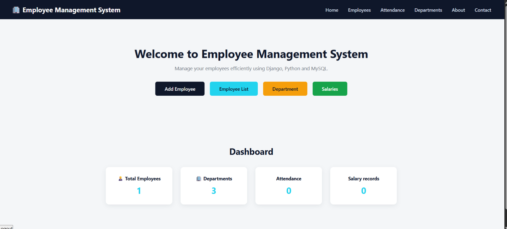
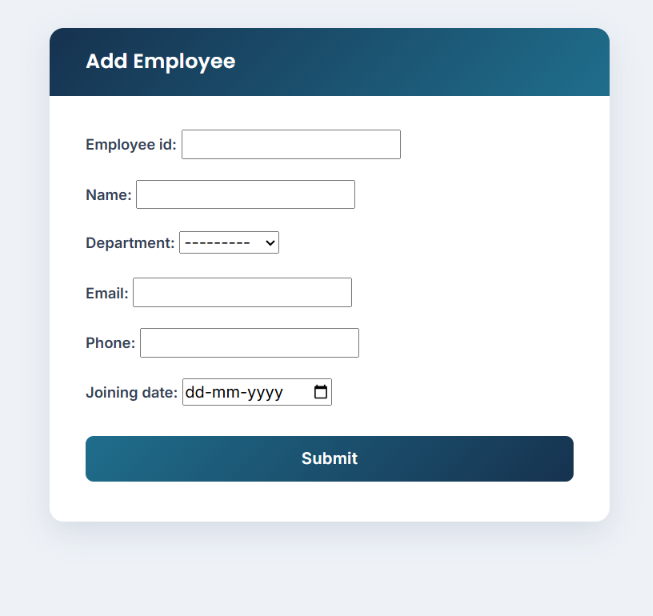
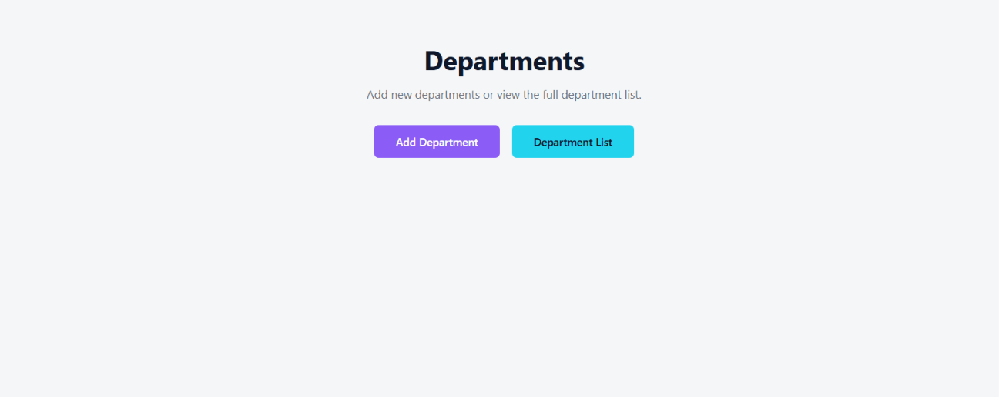
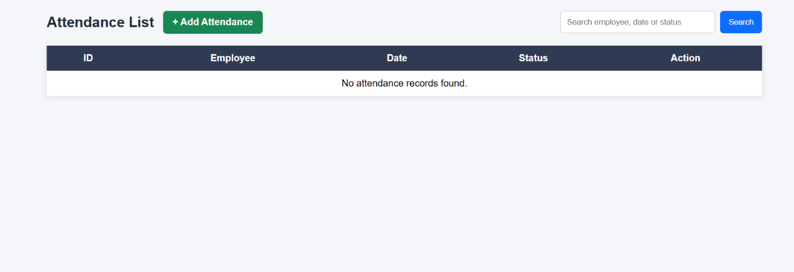
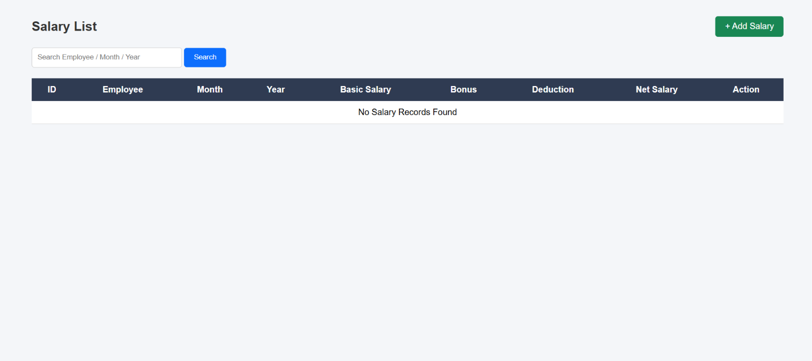
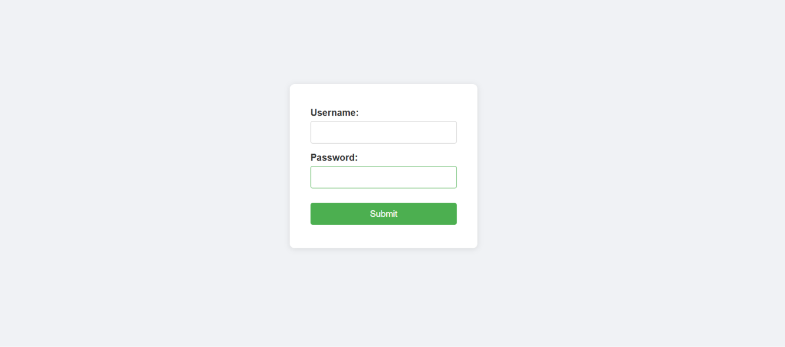

# 👨‍💼 Employee Management System


### 🚀 A Full-Stack Employee Management System built with Django

Manage employees, departments, attendance, salaries and more through a simple web-based management system.

- 👨‍💼 Employees
- 🏢 Departments
- 📅 Attendance
- 💰 Salaries
- 📊 Dashboard
- 🔐 Authentication
- 🔌 REST APIs

The project was developed to gain practical experience in **Django full-stack development, database management, CRUD operations, REST APIs, authentication, and deployment**.

---

## ✨ Features

### 👨‍💼 Employee Management

- ➕ Add employees
- 👀 View employee details
- ✏️ Update employee information
- 🗑️ Delete employees
- 🔍 Search employees
- 📄 Pagination

 ## 🛠️ Technologies Used

### 🐍 Backend

- Python
- Django
- Django REST Framework

### 🎨 Frontend

- HTML5
- CSS3
- JavaScript

### 🗄️ Database

- MySQL — Development
- PostgreSQL — Production

### 🚀 Deployment

- Render
- Gunicorn
- WhiteNoise

### 🌿 Version Control

- Git
- GitHub

---

[](https://employee-management-system-django-gipu.onrender.com/)

[](https://github.com/Harshalanka522/Employee-Management-System-Django)

[](https://www.python.org/)

[](https://www.djangoproject.com/)


---

## 🌐 Live Project

### 🚀 Try the Application

👉 **[OPEN LIVE EMPLOYEE MANAGEMENT SYSTEM](https://employee-management-system-django-gipu.onrender.com/)**

The application is deployed on **Render** and uses **PostgreSQL** as the production database.

---

## 📸 Project Screenshots

> Screenshots below show the actual application interface.

### 🏠 Dashboard



---

### 👨‍💼 Employee Management



---

### 🏢 Department Management



---

### 📅 Attendance Management



---

### 💰 Salary Management



---

### 🔐 Login Page



---

### 🏢 Department Management

- ➕ Add departments
- 👀 View departments
- ✏️ Update department information
- 🗑️ Delete departments

### 📅 Attendance Management

- 📝 Manage attendance records
- 👀 View attendance information
- 📅 Track employee attendance

### 💰 Salary Management

- 💵 Manage employee salaries
- ⚡ Automatic net salary calculation
- 📊 View salary information

### 📊 Dashboard

- 📈 Employee statistics
- 🏢 Department information
- 📅 Attendance information
- 💰 Salary information

### 🔐 Authentication & Authorization

- 🔑 User login
- 🚪 Logout
- 🛡️ Authentication
- 👑 Django Admin Panel

### 🔌 REST API

- ⚡ Django REST Framework
- 👨‍💼 Employee API
- 🔗 API endpoints for employee data

---

## 🏗️ Project Structure

```text
Employee-Management-System-Django/
│
├── 📁 apps/
│   │
│   ├── 📁 employees/
│   ├── 📁 department/
│   ├── 📁 attendance/
│   ├── 📁 salary/
│   └── 📁 api/
│
├── 📁 config/
│   ├── ⚙️ settings.py
│   ├── 🔗 urls.py
│   └── 🚀 wsgi.py
│
├── 📁 templates/
│
├── 📁 staticfiles/
│
├── 📁 screenshots/
│   ├── 🖼️ dashboard.png
│   ├── 🖼️ employees.png
│   ├── 🖼️ departments.png
│   ├── 🖼️ attendance.png
│   ├── 🖼️ salary.png
│   └── 🖼️ login.png
│
├── 📄 manage.py
├── 📄 requirements.txt
├── 📄 .gitignore
└── 📄 README.md
